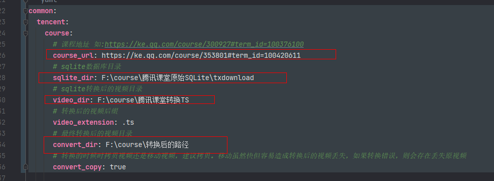

# course

由于购买的腾讯课堂视频快过期了，此间也被一些琐事搞的没有时间去看，故此准备将这些视频下载下来，留待后面再看。腾讯课堂视频过期听说会看不了，故此
下载到本地还是最安心。此程序主要是将转换后的ts视频批量改名。

步骤是将腾讯课堂离线转换到本地,此程序是通过使用m3u8批量转换安卓腾讯课堂下载的离线视频修改名称使用，具体教程如下:

使用教程如下:
1. 解压doc中的m3u8.sqlite转ts视频工具_1.0.10.zip文件或去此链接下载https://gitcode.net/mirrors/liulei901112/txkt_m3u8.sqlite_ts?utm_source=csdn_github_accelerator
2. 去腾讯课堂APP下载视频默认储存路径:【Android/data/com.tencent.edu/files/tencentedu/vidio】将此目录拷贝到电脑

3. 通过m3u8.sqlite选中vidio目录，新建转换的视频目录为ts

4. 找到相应课程的地址链接，如此类似的 https://ke.qq.com/course/300927#term_id=100376100
5. 将本程序下载到本地 course-0.0.1-SNAPSHOT.jar，配置jdk17环境或者下个JDK17直接解压缩后在bin目录,在bin目录输入cmd,如下图:

   
6. 如下，在程序目录，即course-0.0.1-SNAPSHOT.jar同级目录新建新建一个文本文件，命名为：application-prod.yml，配置好相应参数


7. 输入java -jar 后，通过鼠标把course-0.0.1-SNAPSHOT.jar拖到cmd控制台或者手动自己输入地址


## 使用教程
可以直接使用打包好的jar包程序，拷贝到一个目录 course-0.0.1-SNAPSHOT.jar,在新建一个文本文件，命名为：application-prod.yml，内容如下:

```yaml
common:
  tencent:
    course:
      # 课程地址 如:https://ke.qq.com/course/300927#term_id=100376100
      course_url: https://ke.qq.com/course/353801#term_id=100420611
      # sqlite数据库目录（即腾讯课堂Android/data/com.tencent.edu/files/tencentedu/vidio这个目录）
      sqlite_dir: F:\course\腾讯课堂原始SQLite\txdownload
      # sqlite转换后的视频目录
      video_dir: F:\course\腾讯课堂转换TS
      # 转换后的视频后缀
      video_extension: .ts
      # 最终转换后的视频目录
      convert_dir: F:\course\转换后的路径
      # 转换的时候时拷贝视频还是移动视频，建议拷贝。移动虽然快但容易造成转换后的视频丢失，如果转换错误，则会存在丢失原视频
      convert_copy: true

```


